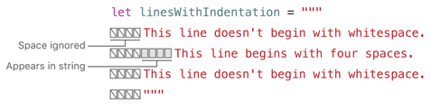

### 字符串和字符

字符串是字符的集合，比如"hello, world" 或者 "albatross"。 Swift字符串使用的是`String`类型。字符串的内容可以用多种方式访问到，包括作为字符的集合。

Swift的`String`和`Character`类型提供了一种方便快速的Unicode兼容的方式来处理代码中的文本数据。字符串创建和操作的语法是轻量级且易读性很强，它的语法跟C语言中的很相似。字符串的拼接就是把两个字符串用＋号连接起来，并且字符串可变性是通过在常量或变量之间进行选择来管理的，这一点和Swift中其他的值一样。你也可以使用字符串来把变量、常量、字面量或者表达式插入到更长的字符串中。这让创建一个自定义字符串来展示，存储和打印变得很容易。

尽管字符串语法很简单，但是Swift的string类型仍然是一种高效的现代化实现方式。每个字符串都是有独立编码的Unicode字符组成，并且提供了多种Unicode形式的字符访问的支持。

```
注意
Swift的字符串类型是与Foundation中的NSString类进行桥接的。Foundation也扩展了String类型，暴露了一些由NSString定义的方法。也就是说，如果你导入了Foundation，就可以在String类型上使用NSString提供的方法，而不需要类型转换。
更多有关在Foundation和Cocoa中使用String的信息，请查看[String和NSString的桥接]()章节。
```

#### 字符串字面量

你可以在代码中用预定义的String类型值来作为字符串字面量。一个字符串字面量就是一系列由双引号包裹的字符。
你可以用字符串字面量来作为一个常量或者变量的初始值：
```
let someString = "Some string literal value"
```

注意Swift会给`someString`这个常量自动推断为字符串类型，因为它是由一个字符串字面量初始化的。

#### 多行字符串字面量

如果你需要一个多行的字符串，那么可以使用多行字符串字面量————一个由三双引号包裹的一系列字符：
```
let quotation = """
The White Rabbit put on his spectacles.  "Where shall I begin,
please your Majesty?" he asked.

"Begin at the beginning," the King said gravely, "and go on
till you come to the end; then stop."
"""
```

多行字符串字面量包含了首尾引号之间的所有行，字符串从开始引号后的第一行开始，结束引号前一行结束，这意味着下例中的字符串没有以换行符开头或结尾：
```
let singleLineString = "These are the same."
let multilineString = """
These are the same.
"""
```

如果你的源代码中的多行字符串字面量内含有一个换行符，那么这个换行符也会在字符串值中出现。如果你想要用换行符来让代码更加易读，但是又不想让它成为字符串的值的一部分，那么可以在行尾使用反斜杠`\`:
```
let softWrappedQuotation = """
The White Rabbit put on his spectacles.  "Where shall I begin, \
please your Majesty?" he asked.

"Begin at the beginning," the King said gravely, "and go on \
till you come to the end; then stop."
"""
```

如果要让多行字符串字面量以空行开头或结尾，只需要在头或尾部写一个空行即可，例如：
```
let lineBreaks = """

This string starts with a line break.
It also ends with a line break.

"""
```

多行字符串可以根据周围代码来进行缩进。具体情况可以参考下图：


在上面的例子中，即使整个多行字符串字面量有缩进，第一行和最后一行前面也不会有空格缩进。中间行比`'''`符号有更多的缩进，所以它会以额外的四个空格开始。

#### 字符串字面量中的特殊字符

字符串字面量可以包含以下特殊字符：
+ 特殊转义字符：`\0`(空字符)、`\\`(反斜杠)、`\t`(制表键)、`\n`(换行符)、`\r`(回车符)、`\"`(双引号)、`\'`(单引号)
+ 任意Unicode标量值, 写法是`\u{n}`,其中n是1-8个十六进制数字(Unicode会在下面的[Unicode]()章节讨论)

下面的代码展示了这些特殊字符中的四个例子。常量`wiseWords`包含了两个转义的双引号。常量`dollarSign`,`blackHeart`和`sparklingHeart`代表的是Unicode标量:
```
let wiseWords = "\"Imagination is more important than knowledge\" - Einstein"
// "Imagination is more important than knowledge" - Einstein
let dollarSign = "\u{24}"        // $,  Unicode scalar U+0024
let blackHeart = "\u{2665}"      // ♥,  Unicode scalar U+2665
let sparklingHeart = "\u{1F496}" // 💖, Unicode scalar U+1F496
```

因为多行字符串字面量使用了三个双引号而不是一个，所以你可以在它之中直接使用双引号而无需转义。如果要在多行字符串中包含文本`"""`, 那么需要转义至少一个引号，例如：
```
let threeDoubleQuotationMarks = """
Escaping the first quotation mark \"""
Escaping all three quotation marks \"\"\"
"""
```

##### 扩展字符串分隔符

你可以把一个字符串字面量放在字符串的扩展分隔符中来包含特殊的字符而不会使它的转义生效。把字符串放在引号中，两边再用#号来包裹起来。例如，字符串`#"Line 1\nLine 2"#`会打印出包含'\n'的一行，而不是两行。
如果你需要字符串字面量中字符的特殊效果，请与转义符（\）后面的字符串中数字符号的数目相匹配。例如，如果你的字符串是#"Line 1\nLine 2"#, 并且你想要换行，那么可以用#"Line 1\#nLine 2"#,同样的，###"Line 1\###nLine 2"### 这样也可以实现换行。

由扩展分隔符创建的字符串字面量也可以是多行字符串字面量。你可以使用扩展分隔符在多行字符串中把`"""`包含进去。例如：
```
let threeMoreDoubleQuotationMarks = #"""
Here are three more double quotes: """
"""#
```

